# binthere

**Stop saying "where the fuck is this?"**

binthere is a native iOS app for tracking physical items stored in bins, drawers, and containers. Scan a QR or NFC tag on a bin to instantly see what's inside. Add items with photos and let AI pre-fill the details. Check things in and out, move them between bins, and never lose track of your stuff again.

---

## What it does

- **Scan a QR or NFC tag** on a bin to see exactly what's in it
- **Auto-generated bin codes** (like `D4J6`) on printable QR labels with your bin ID front and center
- **AI-powered item detection** — snap a photo of bin contents and Claude identifies, names, and tags each item for you to review
- **Color-coded bins and items** for at-a-glance visual organization
- **Zones with icons** — group bins by room (Garage, Office, Attic) with SF Symbol icons and colors
- **HomeKit room import** — pull room names straight from your Apple Home setup
- **Check items out and back in** — track who has what and when it's due back
- **Move items between bins** without losing their history
- **Tags and custom fields** on every item

## Screenshots

<p align="center">
  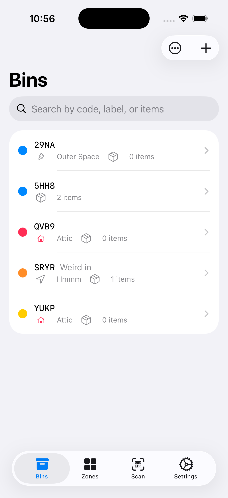
  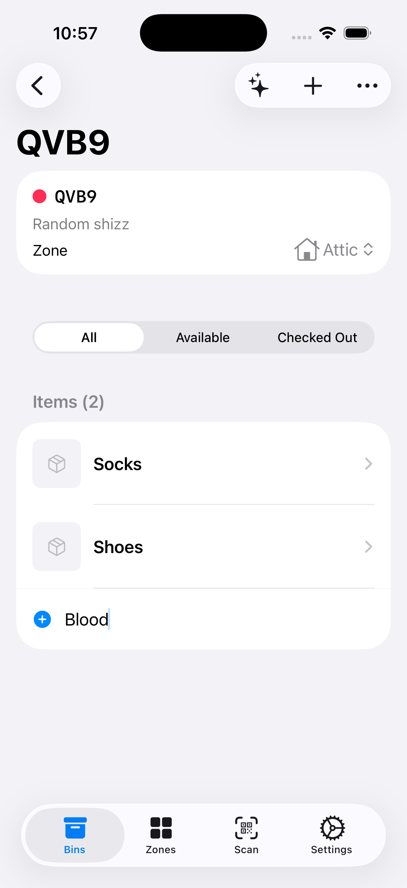
  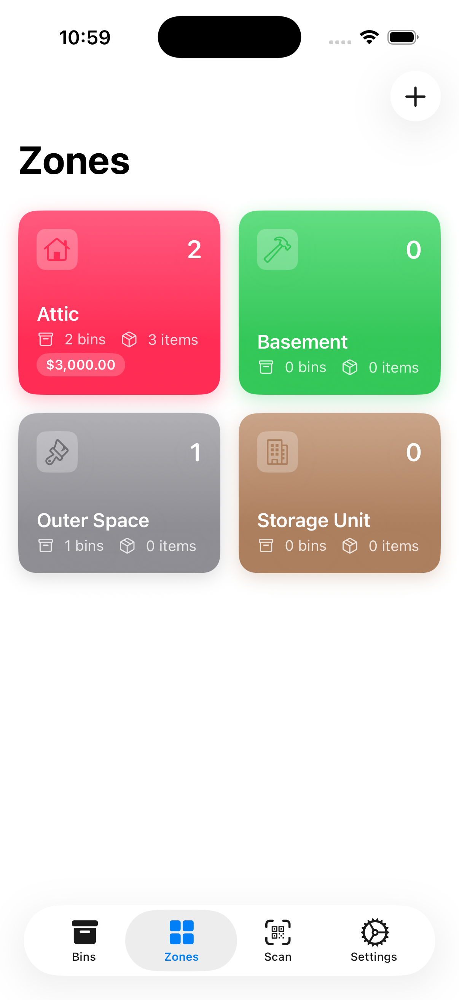
  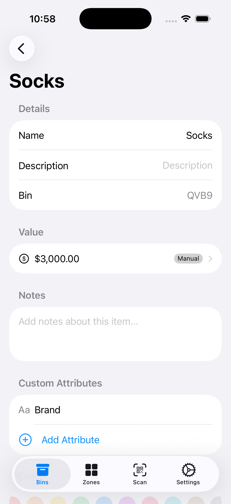
</p>

<p align="center">
  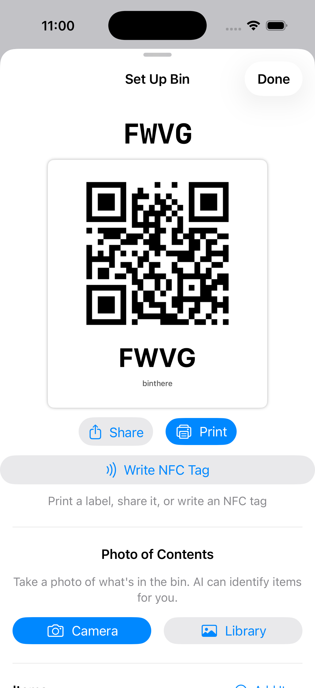
  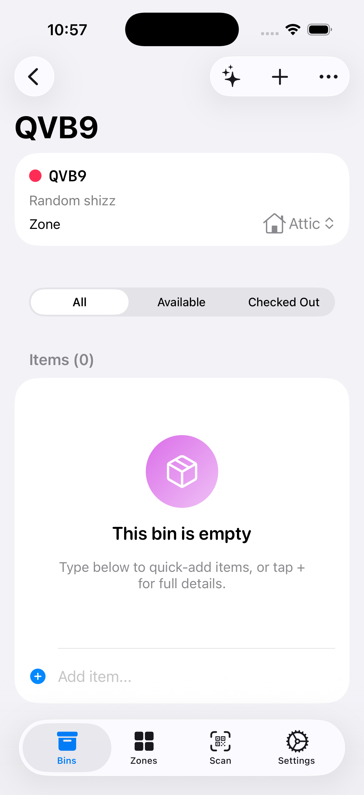
  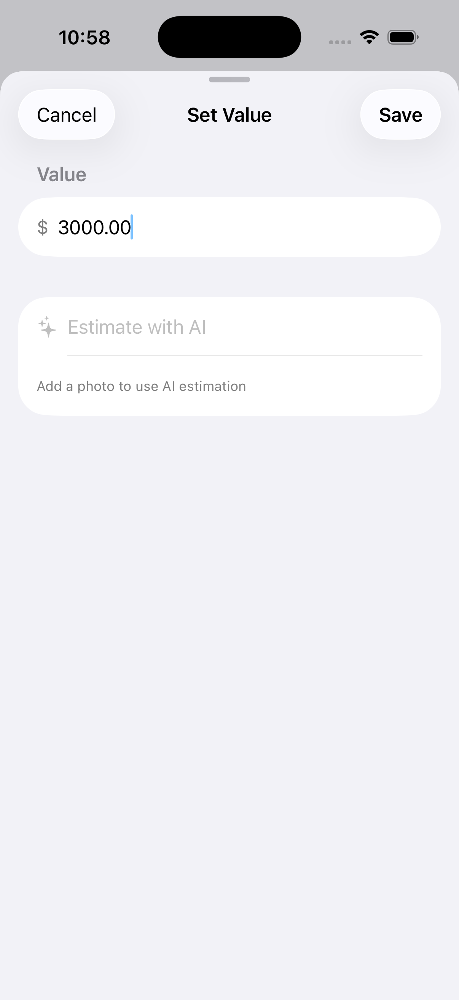
  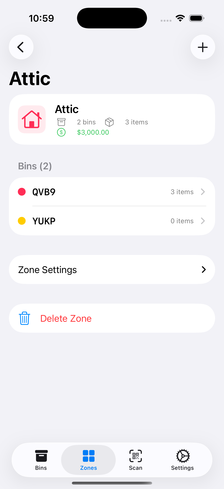
</p>

<p align="center">
  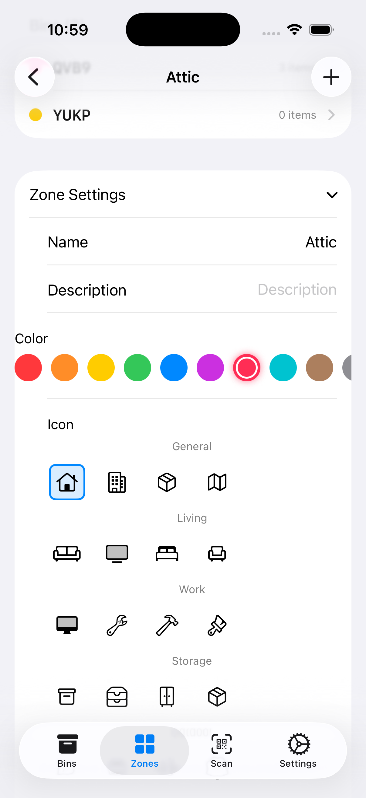
  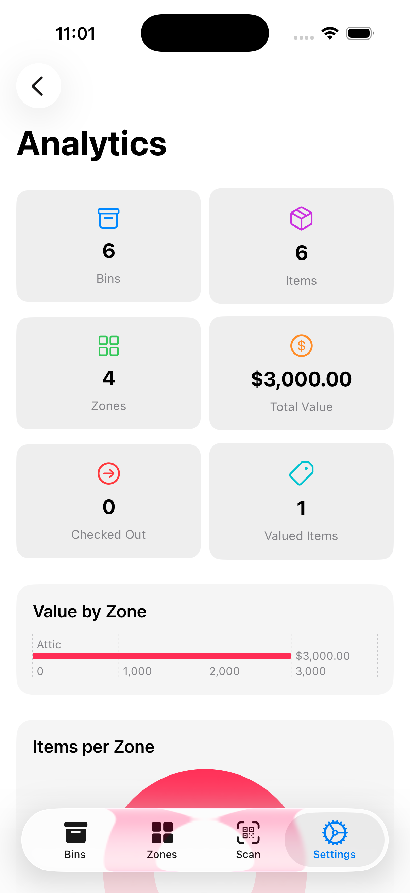
  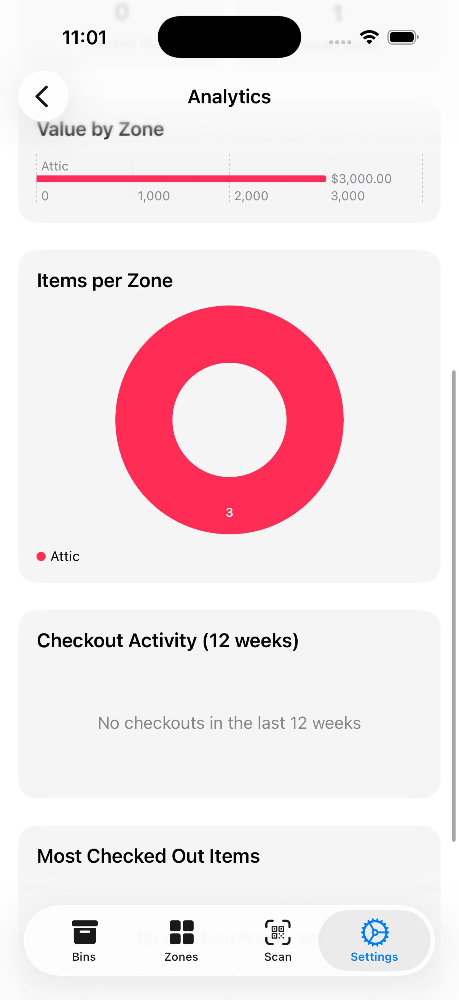
  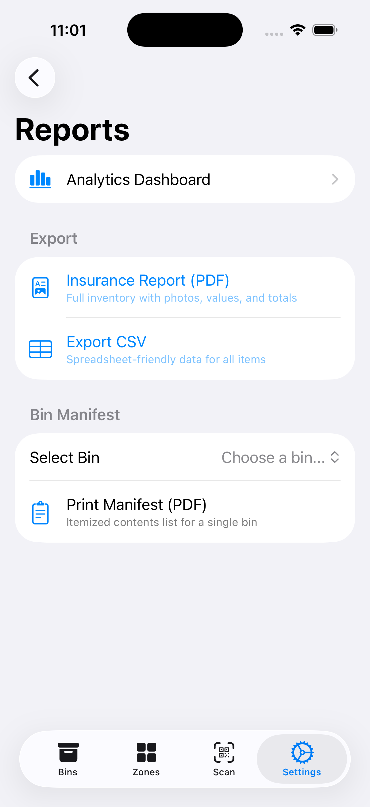
</p>

<p align="center">
  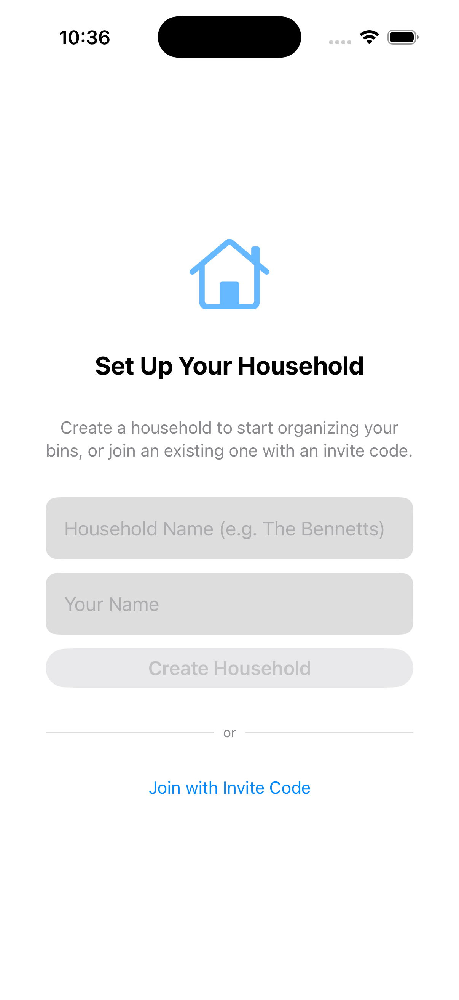
  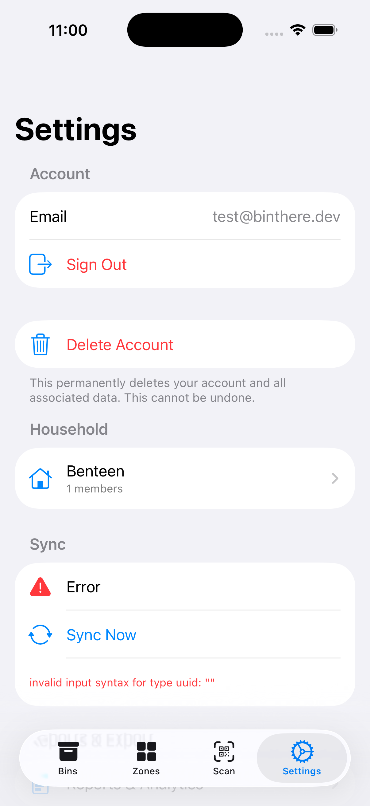
  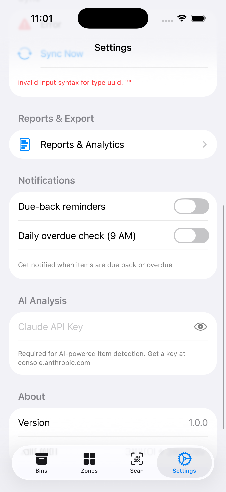
  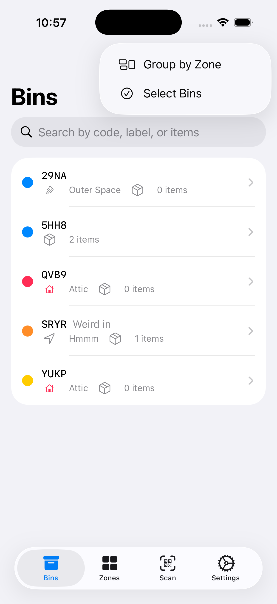
</p>

## Tech Stack

- **SwiftUI** — iOS 17+
- **SwiftData** — local persistence with `@Model` and `@Query`
- **Claude API** — vision-based item detection ([anthropic.com](https://www.anthropic.com))
- **Core NFC** — NDEF tag reading and writing
- **HomeKit** — one-time room import
- **AVFoundation** — QR code scanning
- **UserNotifications + APNs** — reminders (coming soon)

## Project Structure

```
binthere/
├── App/                 # App entry, ModelContainer
├── Models/              # Bin, Item, Zone, CheckoutRecord (@Model)
├── Views/
│   ├── Bins/            # List, detail, creation flow
│   ├── Items/           # Add, detail, AI analysis
│   ├── Zones/           # Grid view (main tab)
│   ├── Scanner/         # QR + NFC scanning
│   └── Settings/        # Zone management, API key
├── Services/            # Image storage, QR/NFC, AI analysis, HomeKit
├── Utilities/           # Color palette, icon palette, code generator
```

## Getting Started

### Prerequisites
- Xcode 16 or later
- iOS 17+ target
- (Optional) [Claude API key](https://console.anthropic.com) for AI item detection
- (Optional) Physical device for NFC and HomeKit testing

### Setup
```bash
git clone https://github.com/patrickisgreat/binthere.git
cd binthere
open binthere.xcodeproj
```

Build and run on a simulator or your device. For AI detection, add your Claude API key in **Settings → AI Analysis**.

## Development

```bash
# Build
xcodebuild -scheme binthere -destination 'platform=iOS Simulator,name=iPhone 17 Pro' build

# Test
xcodebuild test -scheme binthere -destination 'platform=iOS Simulator,name=iPhone 17 Pro'

# Lint
swiftlint lint --strict
```

### Workflow
- **Feature branches only** — never commit to `main`
- **Conventional commits** (`feat:`, `fix:`, `chore:`, `docs:`, `test:`, `refactor:`)
- **PRs reviewable in one sitting** — split big changes into stacked PRs
- CI runs SwiftLint, build, and tests on every PR
- release-please handles versioning and changelog

See [CLAUDE.md](CLAUDE.md) for the full coding conventions and architecture guide, and [ROADMAP.md](ROADMAP.md) for planned features.

## Roadmap

**Done:**
- Core app with SwiftData, QR scanning, AI analysis, checkout
- Bin auto-codes and color coding
- Zone overhaul with icons, detail views, HomeKit import
- NFC tag reading and writing

**Next:** Custom attributes, valuations, insurance reports, multi-user permissions, notifications. See [ROADMAP.md](ROADMAP.md) for the full list.

## License

See [LICENSE](LICENSE).
